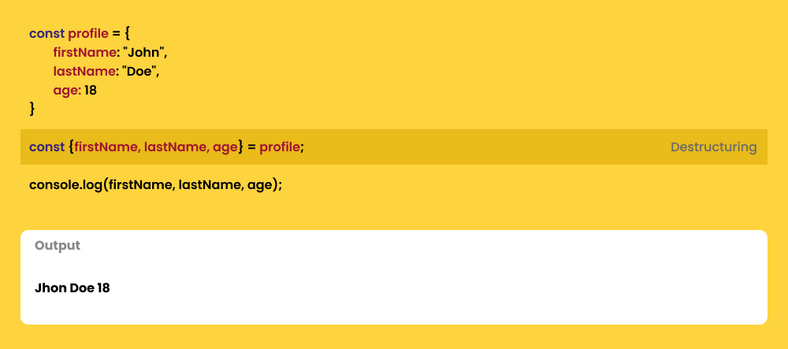
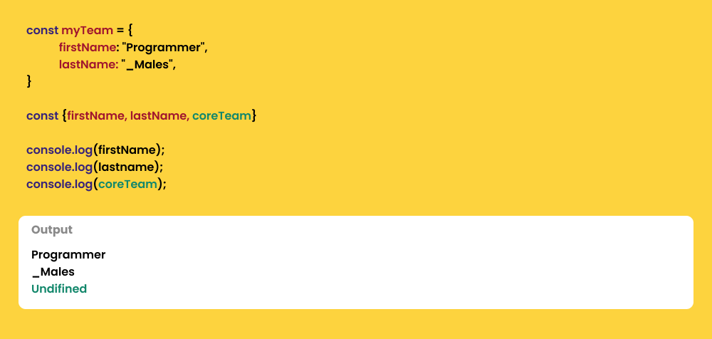
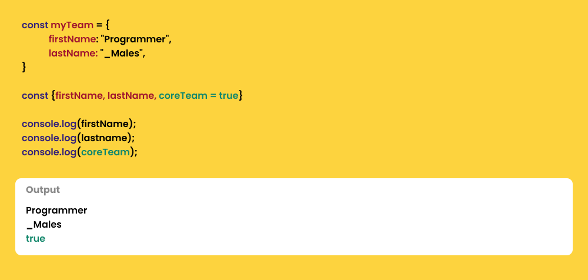

# Destructuring

### Apa itu Destructuring ?

> Destructuring dalam JavaScript merupakan sintaksis yang dapat mengeluarkan nilai dari array atau properties dari sebuah object ke dalam satuan yang lebih kecil.

## **Destructuring Object**

Menggunakan object literal ({}) di sisi kiri dari operator assignment



Dalam melakuannya pastikan penamaan sama seperti property objectnyakita bisa menentukan salah satu nilai yang ingin kita desktrukturisasikan. Sehingga kita tidak perlu membuat variabel sebanyak properti yang dimiliki objeknya, contohnya:

```
const {lastName} = profile;

--- Output -----------------------------
Doe

----------------------------------------
```

-   ### Destructuring Assigment

    Adalah cara memasukan nilai destructuring ke dalam variabel yg sudah ada

    ```
    const myTeam = {
    firstName: "Programmer",
    lastName: "_Males",
    }

    let firstName = "Designer";
    let lastname = 'Rajin';

    // menginisialisasi nilai baru melalui destructuring object
    ({firstName, lastname} = myTeam);

    console.log(firstName);
    console.log(lastname);

    --- Output -----------------------------
    Programmer
    _Males

    ----------------------------------------

    ```

    > Noted : saat melakukan destructuring assignment, perlu dilakukan di dalam tanda kurung (). Agar javascript tidak mengira kita sedang membuat block statement

-   ### Default Values

    Jika nama variabel yang kita buat tidak sesuai dengan property dari objectnya maka akan menjadi undefined,

    
    **Bagaimana jika ingin variabel default tidak ber nilai undefined ?**
    berikut adalah caranya :

    

    > artinya, jika nilai property tidak ditemukan, maka nilai defaultlah yang akan di terapkan

-   ### Bagaimana jika kita ingin melakuan destructor dengan penamaan variabel yang berbeda dari property objectnya ?

    ```
    const {firstName: localFirstName, lastName: localLastName, coreTeam: localCoreTeam} = myTeam;
    ```
